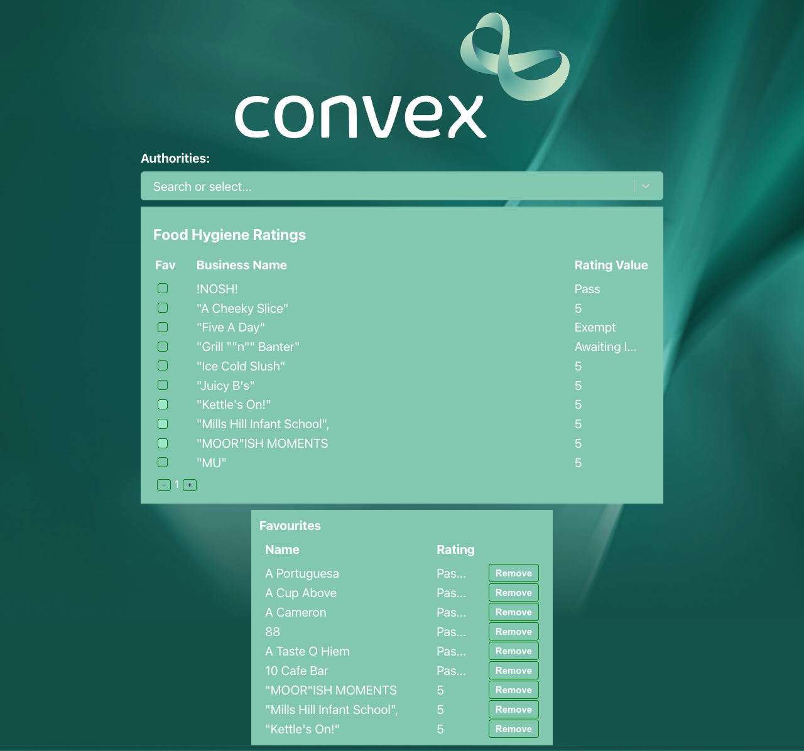
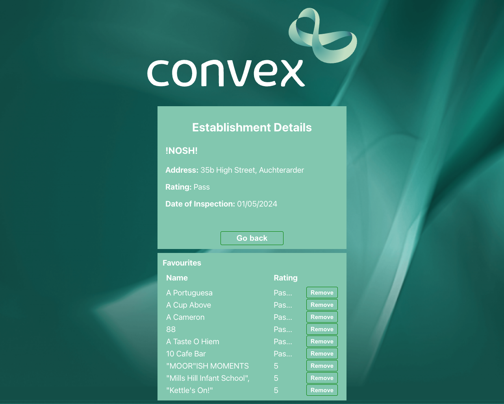

# react-ts-tech-test

This is Convex React TypeScript Tech Test.

## Requirements

- npm
- Access to the Internet
- Suitable development environment

## Getting Started

- Run it: `npm start`
- Test it: `npm test`
- Build it: `npm build`
- Run E2E tests: `npm run cypress`

## Improvements

- Appearance

- Increased table font size
- Added:
  - **Loading states** for better UX
  - Unit and snapshots tests
  - Cypress E2E test suite
  - Authorities' dropdown filter
  - `useQuery` for API response **caching mechanism** and **retries**
  - Establishment details page
  - Favourites table

## Tests

### Unit Tests

- **Table Component**
    - Renders table with correct columns and data.
    - Displays loading state when data is being fetched.
    - Uses cache when navigating to previous page.
    - Filters list by selected authority.

- **Authorities Dropdown Filter**
    - Renders all available authorities.
    - Selects authority id properly
    - Loads more authorities in infinite scroll mode.
    - Filters authorities based on user input

- **Favourites Table**
    - Renders nothing when there are no favourites.
    - Renders a list of favourites.
    - Removes favourites properly.

- **Establishment Details Page**
    - Fetches and displays establishment details.
    - Handles loading and error states.
    - Navigates back to the home page properly.

### Snapshot Tests

- Table renders correctly with sample data.
- Details page matches expected UI.
- Dropdown filter renders as expected.

### Cypress E2E Tests

- Loads main page and displays establishments table.
- Shows loading state properly.
- Uses cache for previously fetched data.
- Filters establishments by authority.
- Navigates to establishment details page.
- Adds and removes establishments from favourites at home page.
- Adds and removes establishments from favourites at details page.
